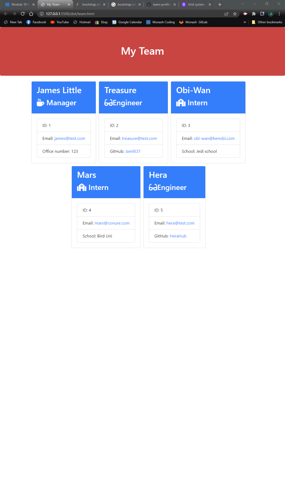

# W10-OOP-PROFILER
## Description
The task was to create an application that dynamically generates a list of employee's dependent on user input and append this to a new file. Helped by the Inquirer package and Jest, we run this application with npm and node. Initialisation occurs on node index.js. 

## Screenshots of Application

## Video link
https://drive.google.com/file/d/1kn5N0IxcPSNJU4S8K-Yjmpqpl0XjXyKF/view

## GitHub
https://github.com/Jamlit37/W10-OOP-PROFILER

